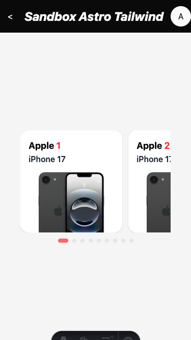

# Walkthrough: Solución de Desbordamiento Horizontal en Slider

Este walkthrough detalla la corrección del bug que generaba un scroll horizontal en toda la ventana cuando se utilizaba el componente `Slider` en dispositivos móviles.

## 🔴 El Problema

Al visualizar el slider en pantallas pequeñas (ej: 375px), la página mostraba una barra de desplazamiento horizontal. Esto sucedía porque el contenido interno del slider (los slides) forzaba al contenedor a mantener un ancho mayor al de la pantalla, ignorando el `max-w-5xl` del layout.

## 🔍 Análisis Técnico

En layouts de tipo **Flexbox** o **Grid** (como los usados en el `header` y `main` de la aplicación), los elementos hijos tienen por defecto un valor de `min-width: auto`. 

Esto significa que:
1. El contenedor del slider veía que sus hijos (los cards) eran muy anchos.
2. Al ser un item flex, se negaba a encogerse por debajo del ancho de su contenido para evitar "romperse".
3. Esto empujaba los márgenes de la página hacia afuera, creando el scroll horizontal global.

## ✅ La Solución

Hemos aplicado dos cambios clave en `Slider.astro` para permitir que el componente sea realmente responsivo:

1. **`w-full`**: Asegura que el contenedor siempre intente ocupar el 100% disponible, no más.
2. **`min-w-0`**: Esta es la "fórmula mágica" en Tailwind/Flexbox. Cambiar el mínimo por defecto a `0` permite que el contenedor flex se encoja correctamente independientemente del ancho de lo que tenga dentro (ya que Embla se encarga de gestionar el overflow interno).

### 🛠️ Código Corregido

```diff
<!-- Slider.astro -->
-<div class={cn("flex flex-col gap-3", classNames?.root)}>
+<div class={cn("flex flex-col gap-3 w-full min-w-0", classNames?.root)}>
   <!-- Carousel -->
-  <div class="overflow-hidden" id={id}>
+  <div class="overflow-hidden w-full min-w-0" id={id}>
     <div class={cn("flex gap-3", classNames?.container)}>
       <slot />
     </div>
   </div>
```

## 📱 Verificación

Se utilizó **Playwright** para simular un iPhone (375px) y verificar que el ancho del documento coincide exactamente con el ancho de la ventana (`375px`), eliminando el desbordamiento.



---
> [!TIP]
> Siempre que uses contenedores flex que tengan contenido dinámico o muy ancho (como carruseles), recuerda usar `min-w-0` para evitar que rompan el layout responsivo.
